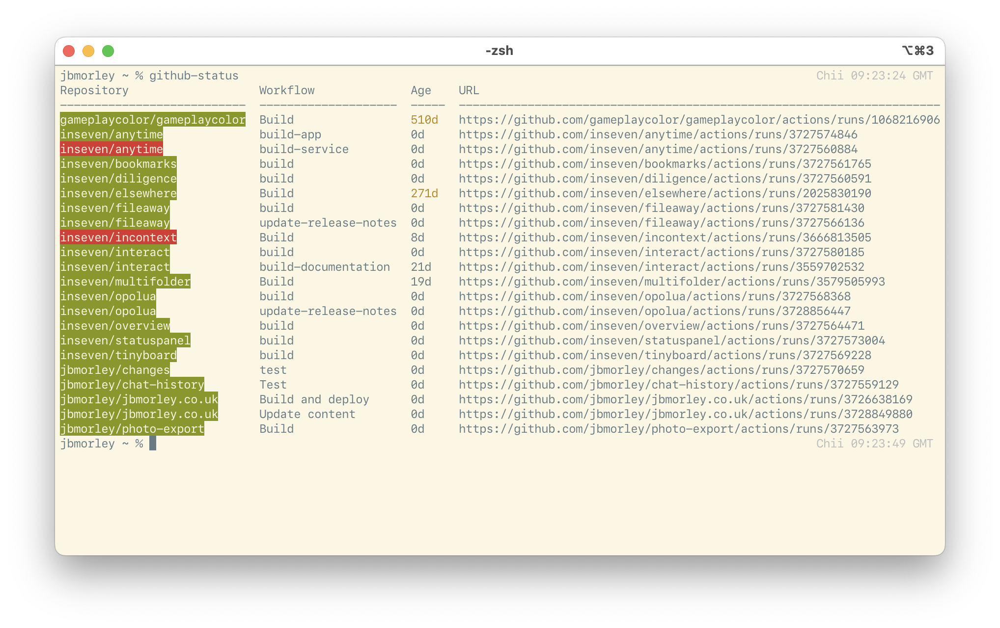

# github-status

Light-weight command line utility for showing the status of GitHub projects



## Usage

Quickly report on recent actions by passing the repository on the command-line:

```bash
github-status inseven/fileaway
```

Multiple repositories can be collected into one report by passing each repository as a new argument:

```bash
github-status inseven/fileaway inseven/bookmarks inseven/symbolic
```

### Configuration

For more nuanced reporting, `github-status` supports a global configuration file (`~/.github-status-configuration.yaml`)  which will be used when no command-line arguments are passed. This lets you select the number of historical builds that are reported, require results for specific workflows, and require workflow runs come from specific branches (`main` and `master` are assumed by default).

For example, my configuration file looks like this:

```yaml
defaults:

  limit: 1
  branches:
    - main

repositories:

  - name: inseven/anytime
    workflows:
      - build-app
      - build-service

  - name: inseven/bookmarks
    workflows:
      - build

  - name: inseven/diligence
    workflows:
      - build

  - name: inseven/elsewhere
    workflows:
      - Build

  - name: inseven/incontext
    workflows:
      - Build

  - name: inseven/opolua
    workflows:
      - build
      - update-release-notes

  - name: inseven/statuspanel
    workflows:
      - build

  - name: inseven/fileaway
    workflows:
      - build
      - update-release-notes

  - name: inseven/interact
    workflows:
      - build
      - build-documentation

  - name: inseven/overview
    workflows:
      - build

  - name: inseven/tinyboard
    workflows:
      - build

  - name: jbmorley/chat-history
    workflows:
      - Test

  - name: jbmorley/photo-export
    workflows:
      - Build

  - name: jbmorley/changes
    workflows:
      - test

  - name: jbmorley/multifolder
    workflows:
      - Build

  - name: gameplaycolor/gameplaycolor
    workflows:
      - Build
```

